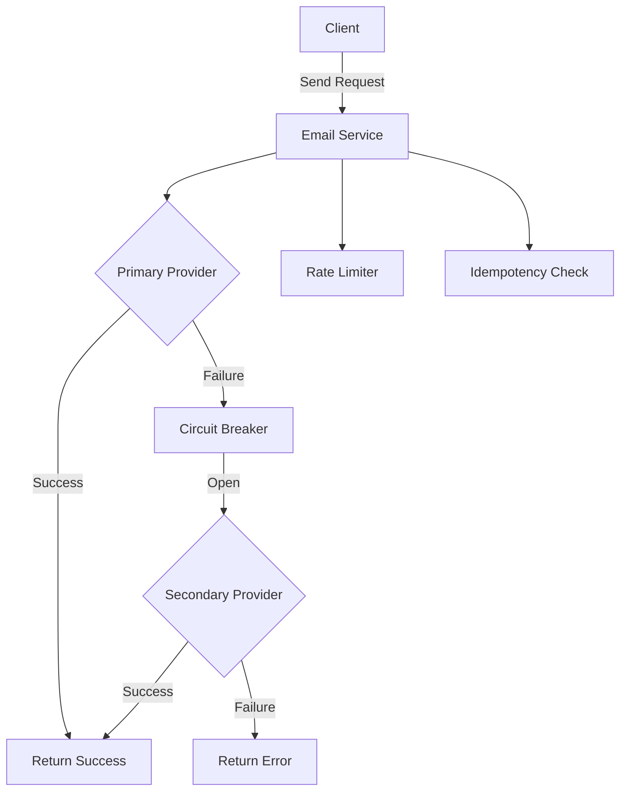
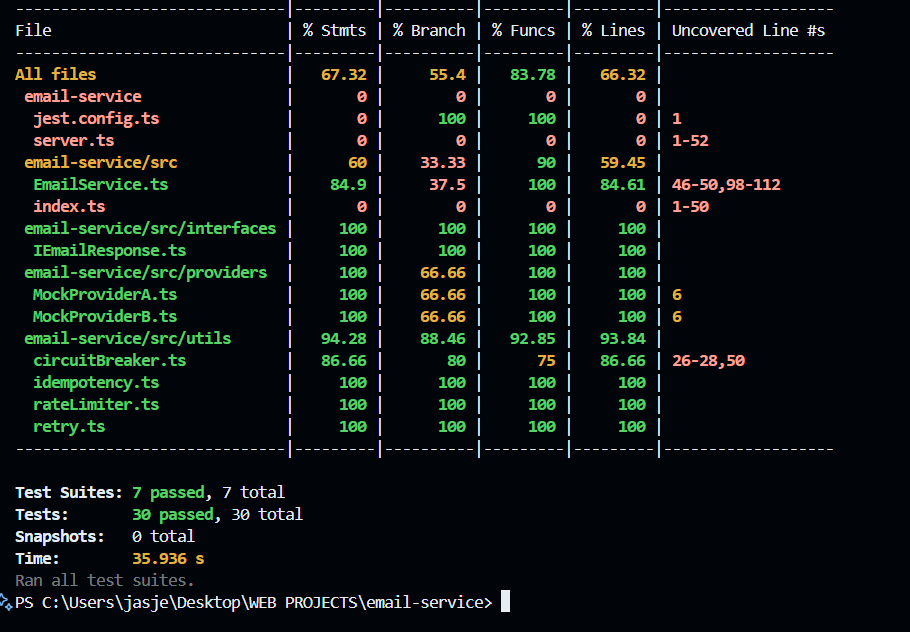

# Resilient Email Sending Service

A robust email delivery service with built-in reliability patterns including retries, circuit breakers, rate limiting, and failover between multiple providers.

## Table of Contents
- [Features](#features)
- [Architecture](#architecture)
- [Tech Stack](#tech-stack)
- [Local Setup](#local-setup)
- [Testing](#testing)
- [Deployment](#deployment)
- [Contributing](#contributing)
- [License](#license)

## Features

### Core Functionality
- 📧 Multi-provider email delivery (Primary + Secondary)
- 🔄 Automatic failover between providers
- 🔁 Configurable retry mechanism with exponential backoff

### Reliability Patterns
- ⚡ Circuit Breaker implementation
- 🚦 Rate limiting
- 🔑 Idempotency support
- 📊 Status tracking for all sent emails

### Monitoring
- 📝 Detailed logging
- 🔍 Email status lookup
- ⚠️ Provider health monitoring

## Architecture


**Test Details**



## Tech Stack

**Backend:**
- Node.js
- TypeScript
- Express

**Reliability Patterns:**
- Circuit Breaker
- Exponential Backoff Retry
- Token Bucket Rate Limiting
- Idempotency Keys
- Simple logging
- Fallback mechanism to switch providers

**Testing:**
- Jest
- ts-jest
- Supertest

## Local Setup

### Prerequisites
- Node.js v16+
- npm/yarn
- TypeScript

### Installation
1. Clone the repository:
   ```bash
   git clone https://github.com/jasjeev013/email-service.git
   cd email-service
   ```

2. Install dependencies:
   ```bash
   npm install
   ```

3. Configure environment variables (create `.env` file):
   ```env
   PORT=3000 // Optional
   RATE_LIMIT_WINDOW_MS=60000 // Optional
   RATE_LIMIT_MAX=10 // Optional
   ```

### Running the Service
Start the development server:
```bash
npm run dev
```

The service will be available at:
```
http://localhost:3000
```

## Testing

Run unit tests:
```bash
npm test
```

Run tests with coverage:
```bash
npm test -- --coverage
```

Test watch mode:
```bash
npm run test:watch
```

### Test Cases
- Provider failure scenarios
- Rate limiting behavior
- Circuit breaker state transitions
- Idempotency checks
- Retry logic validation

## Deployment

### Vercel
1. Install Vercel CLI:
   ```bash
   npm install -g vercel
   ```

2. Deploy:
   ```bash
   vercel
   ```

### Docker
Build the Docker image:
```bash
docker build -t email-service .
```

Run the container:
```bash
docker run -p 3000:3000 email-service
```

## Contributing

1. Fork the project
2. Create your feature branch (`git checkout -b feature/AmazingFeature`)
3. Commit your changes (`git commit -m 'Add some AmazingFeature'`)
4. Push to the branch (`git push origin feature/AmazingFeature`)
5. Open a Pull Request

## License

Distributed under the MIT License. See `LICENSE` for more information.

---

<div align="center">
  <p>
    <a href="https://github.com/jasjeev013/email-service">GitHub Repo</a> •
    <a href="https://jasjeev013.github.io/email-service">Live Demo</a>
  </p>
</div>
```